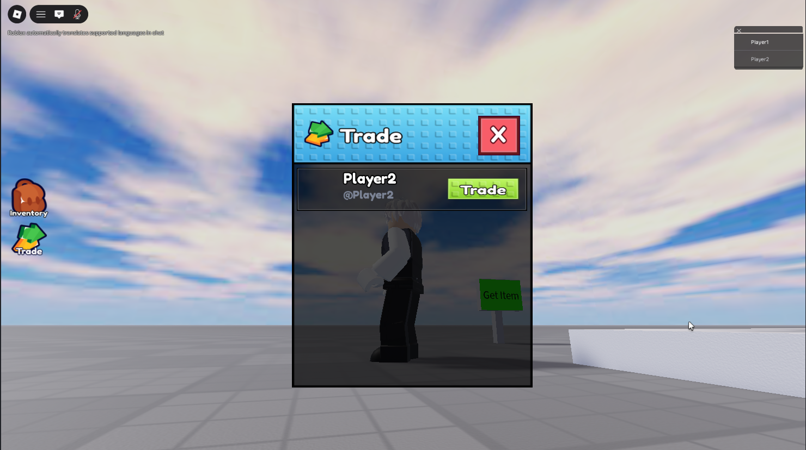
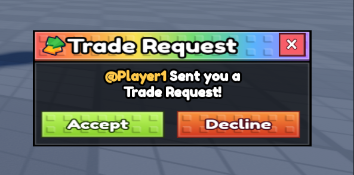
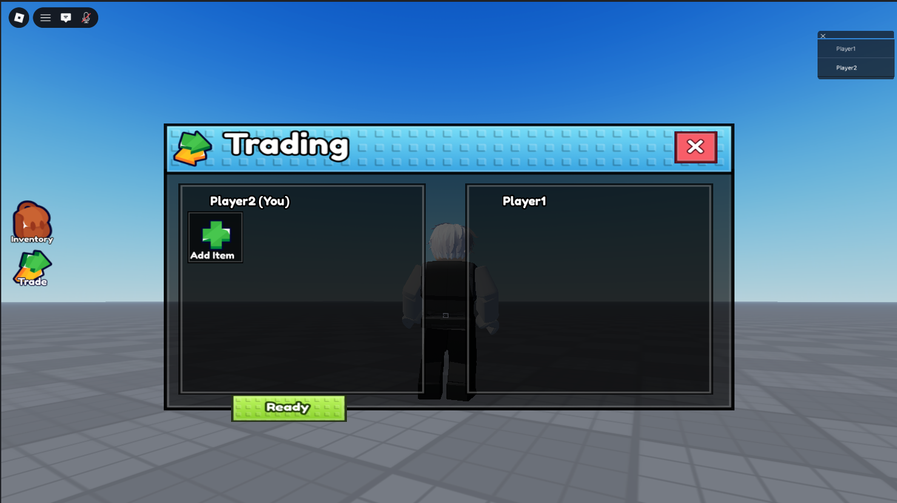
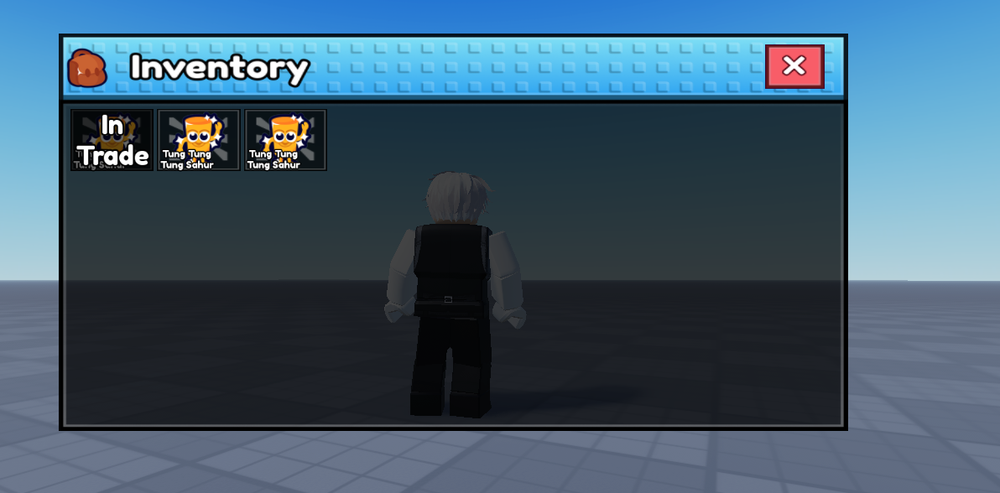
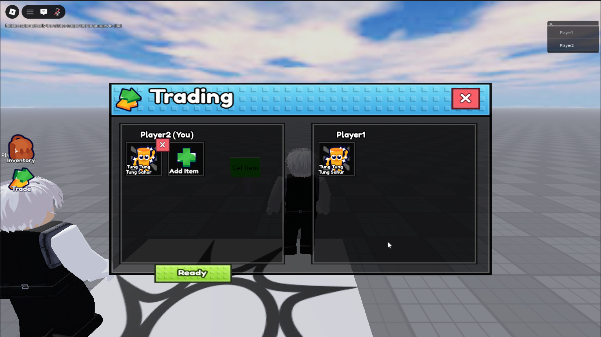
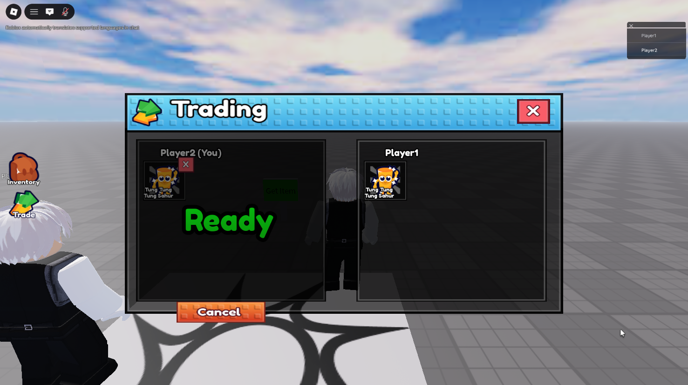
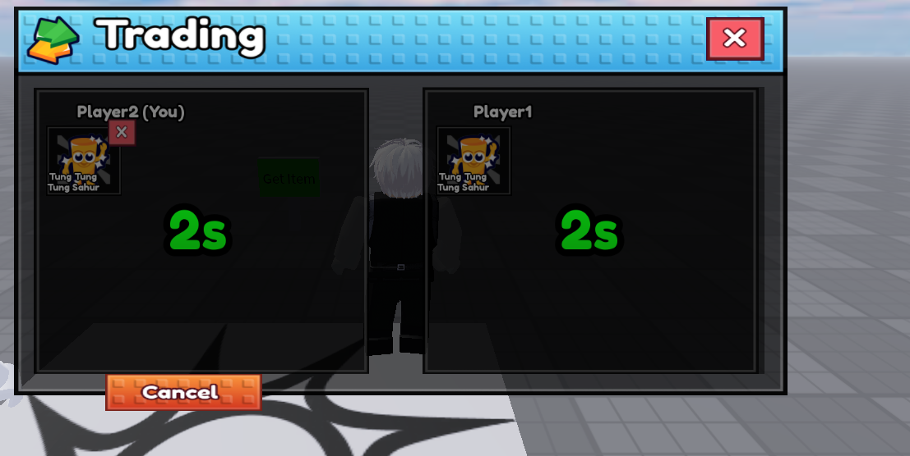

# RyZz Trade Service
A secure, server-authoritative player-to-player trading system for Roblox, written in Luau. Real-time mirrored trade UI, item add/remove, double-ready countdown and safe inventory swap, with every critical decision validated on the 𝘀𝗲𝗿𝘃𝗲𝗿, never trusted from the client.

## 𝗛𝗼𝘄 𝘁𝗵𝗲 𝗳𝗹𝗼𝘄 𝘄𝗼𝗿𝗸𝘀

1. 𝗦𝗲𝗻𝗱 𝗮 𝗿𝗲𝗾𝘂𝗲𝘀𝘁 — Player A picks Player B from the player list and sends a trade request.


2. 𝗥𝗲𝗾𝘂𝗲𝘀𝘁 𝗽𝗼𝗽𝘂𝗽 — Player B gets a themed popup with the sender's name and Accept/Decline buttons.


3. 𝗧𝗿𝗮𝗱𝗶𝗻𝗴 𝗨𝗜 𝗼𝗽𝗲𝗻𝘀 — after accepting, the mirrored trading window opens for both players. Each player's own items belong on their 'You' side.


4. 𝗜𝗻𝘃𝗲𝗻𝘁𝗼𝗿𝘆 & 𝗮𝗱𝗱𝗶𝗻𝗴 𝗶𝘁𝗲𝗺𝘀 — open your inventory and click items to offer. Already-offered items are marked and can't be added twice.


5. 𝗟𝗶𝘃𝗲 𝗺𝗶𝗿𝗿𝗼𝗿 — added items appear on both screens in real time, on the correct side for each player. Items can be removed before confirming.


6. 𝗢𝗻𝗲 𝘀𝗶𝗱𝗲 𝗿𝗲𝗮𝗱𝘆 — pressing Ready locks your offer; the other player sees your Ready state.


7. 𝗕𝗼𝘁𝗵 𝗿𝗲𝗮𝗱𝘆 → 𝗰𝗼𝘂𝗻𝘁𝗱𝗼𝘄𝗻 → 𝗲𝘅𝗲𝗰𝘂𝘁𝗶𝗼𝗻 — once both are Ready, the server starts the 5-second countdown, then executes the swap: both inventories update and save. The window closes and trading resets.


## Full workflow as a video

[](https://hossindev.github.io/TradeSystem/videos/full-workflow.mp4)

## Notes
- Demo/test remotes are clearly labeled
- Portfolio project built to demonstrate secure multiplayer architecture, RyZz Studio (@ryzzgojo on discord)

## Features
- Full flow: request → accept → add items → remove items → ready → 5s countdown → execute
- Mirrored UI, each player sees their own offers on the 'You' side and the opponent's on the other side, updating live on both screens
- Server-authoritative state, the client only requests changes, the server validates and broadcasts the result
- Exploit-resistant core, no re-entry, no double execution, no forged execution
- Duplicate-offer prevention, empty-trade guard, cancel/decline handling mid-countdown
- Players locked out of starting a second trade while one is active
- Item ownership re-validated against the saved inventory right before the swap
- Clean separation between core logic, remote wiring and UI scripts
## Why it's built this way
This project is deliberately server-authoritative. In Roblox the client can never be trusted, exploiters can fire any RemoteEvent with any arguments. So every handler re-checks the real server-side state before acting:
- acceptTrade verifies the player is part of the trade and flips only their own status
- validateTrade locks the trade so it can't run twice, then runs a server-side 5-second countdown
- executeTrade re-validates both offers against the players' real inventories, performs the swap
saves both inventories, then clears the trade
- The client never holds authority over items, timers, or execution, it only renders what the server sends

## Repository structure

```
TradeService.server.luau ← core trading logic (state machine + validation)
TradingManager.server.luau ← wires RemoteEvents to TradingService functions
EventHandler.client.luau ← client event handling for the full flow
StarterGui/ ← UI: trade request, trading window, inventory
```

## Tech stack
- Luau (Roblox)
- RemoteEvents with server-authoritative validation
- Instance attributes for lightweight state
- DataStore-backed inventory with safe update patterns


